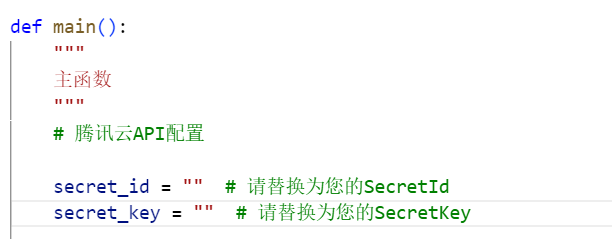

## 要完成的任务

翻译后需要做以下几件事情：

1. 将sport的metadata复制粘贴到翻译后的filtered_item_metadata_translated.json文件中
2. 将filtered_item_metadata.json文件（未翻译过的版本）删除，将filtered_item_metadata_translated.json改名成filtered_item_metadata.json（必须改，涉及路径问题）
3. 进入run文件夹，可以小批量的的测试让代码能跑通即可（主要是看models文件夹下的代码是否更改正确），跑通后直接发给xd，让他用模型训练

anaconda按照官方文档readme配置好环境后，进入outfit-transformer文件夹下运行一下代码，看到跑通即可

（下面2、3开头的py代码是专门用来测试数据量对训练效果的影响的代码，在这里也可以用来测试encoder相关代码修改是否正确。

正式训练用的是1_generate_clip_embeddings.py、2_train_compatibility.py、3_train_complementary.py）

```
python -m src.run.1_generate_clip_embeddings
python -m src.run.2_train_cp_curve
python -m src.run.3_train_cir_curve
```

跑通说明代码没问题，然后交给xd训练即可

## xd直接按照之前官方原文档的指引进行训练即可（如果决定对整个训练集训练的话就这么做）

如果不对整个训练集记得对正式训练要用到的代码2_train_compatibility.py、3_train_complementary.py进行修改


## 翻译操作

1. 注册腾讯云，创建密钥，[api申请](https://console.cloud.tencent.com/cam/capi)
2. 自动会免费送500万额度
3. [剩余额度监控台](https://console.cloud.tencent.com/tmt/resource_bundle)
4. 在data\datasets\polyvore\translate_to_chinese_http.py中替换你的密钥



5.在outfit-transformer文件夹下用anaconda运行

```
python -m src.data.datasets.polyvore.translate_to_chinese_http
```

会自动检测运行到了哪里，然后会有文本框问每翻译多少条就更新一次，你输入1000即可
