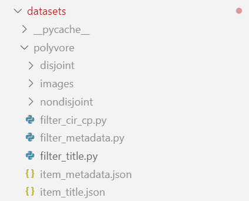

# 修改代码初步实现功能

## 实现功能和思路

### 1 只保留“上装”“下装”两类，数据结构要修改

- 用户从素材库里面选择了自己已有单品，读取该单品的类别信息，先判断，如果是上装，则推荐下装，如果是下装，则判断要推荐的是下装
- 数据加载时过滤数据集，只加载上装下装数据集
- 如何保证CP和CIR功能的套装数据集只考虑上下装？

  - CIR功能：自己写过滤函数，通过answers中第label+1个的类别来判断目标单品的类别，如果不是上下装，就不读取这个数据
  - 写一个过滤的代码文件，将所有的outfit的query和answer分别放进一个列表，筛选条件就是：outfit待填空的单品种类是上下衣（CIR）、一整套服装同时包含上下衣（CP），所有的功能操作都只对已经处理好的query列表、answer列表、outfit列表进行获取，而不是直接从数据库中获取
  - 传数据库的时候，直接根据处理好的列表传
  - **综上，写一个筛选的py文件，最后自动生成筛选后的脚本，用于模型训练**
- how to do ?

  - 创建py文件

    
  - 现在，请阅读项目代码，理解数据结构中nondisjoint每个脚本在项目中会被怎么使用，再去构思py筛选文件怎么写
- CIR任务

  - candidates：都是数据集里answers的内容，有一个事情待确认（answers里面的内容的类别是否都是一样的：是一样的（已确认）），
  - outfit：数据集里的questions，本项目中，outfit内容只能为一个。
  - 综上，只需要对CIR任务中的数据集做以下操作：
    - 根据candidates的类别，保留下candidates类别是上装或者下装的数据
    - 再在第一次筛选过后的列表中，只保留 questions 中上装或下装的id，生成最终版筛选后的脚本文件
- CP任务

  - 确保question中只有上装和下装，倘若筛选过后列表数量不为2，同样舍弃
- 将图片根据metadata筛选并重建

数据结构构建完成，实现下面的内容，重点看models文件、run文件、demo文件

---

### 2 检索逻辑修改：先按类别和场景tag筛选，再KNN检索，k=4

### 3 数据库结构和函数读取时支持多条件筛选（上下装+场景）

### 4 CLIP编码器变成中文，数据集变成中文

问题：demo的推理阶段并没有使用到用户可以输入的文本description

要实现KNN检索！

实现汉化

# 对素材库进行demo测试

## 1 问题记录

### 1.1 素材库内容太匮乏，推荐单品很局限

### 1.2 没有很好的学习到description的内容，颜色相关描述无法准确融合理解，想要黑色裤子反而筛掉了黑色裤子

### 1.3 全身装待处理
