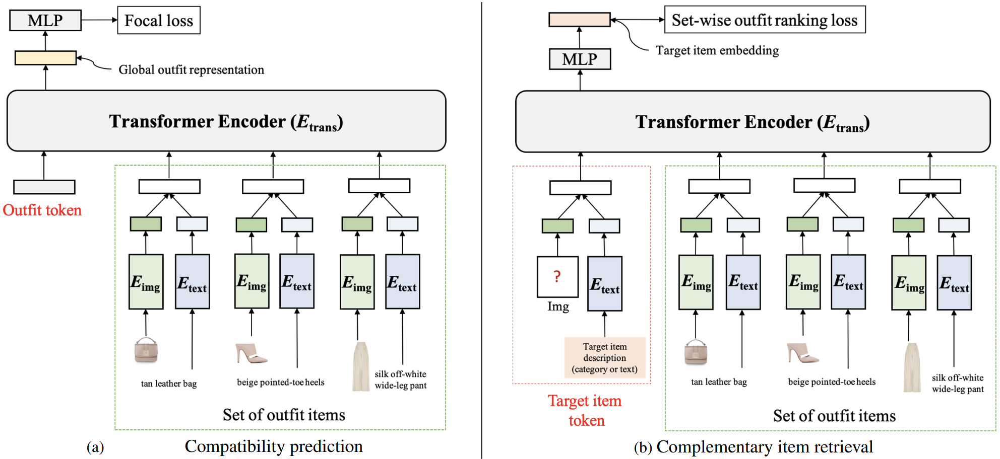
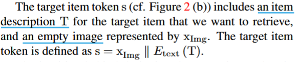
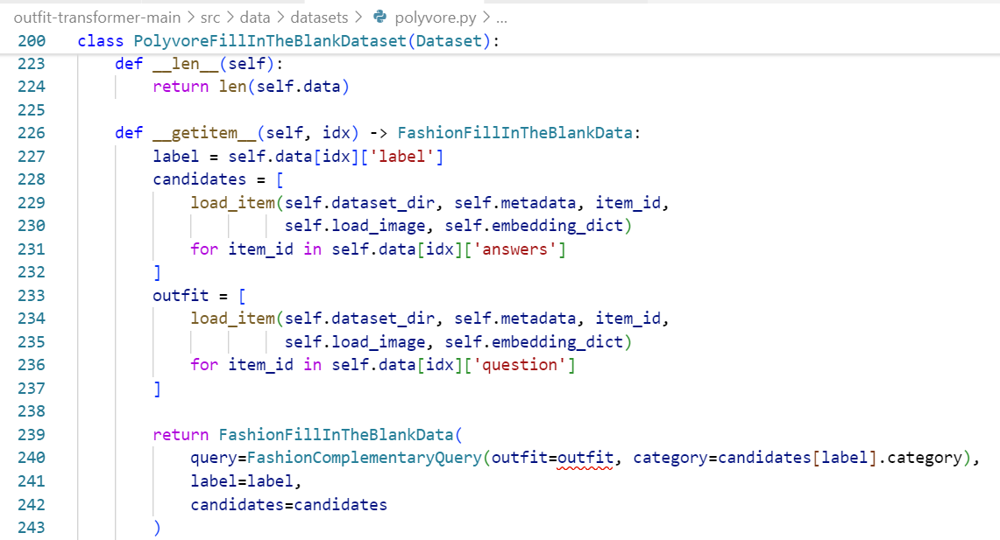
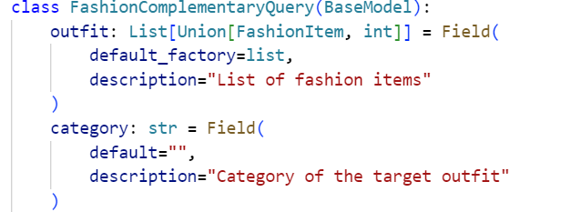

# Outfit-Transformer模型解读

### 1 CIR(Complementary item retrieval)

1. 添加一个组件：

   1. 优先处理description
   2. 描述场景，抽象总结成预设好的场景tag
   3. 添加tag，季节（优先推荐当前季节的衣服）
2. todo：

   1. 数量是否固定：输入一件衣服（上装 or 下装）
   2. 服饰类型确定：除了分上装下装，子类别有什么？
   3. 看看训练数据集数据结构
   4. 同一件衣服多种场景（休闲 or 运动）
   5. 最少需要多少件能验证训练有效性（让模型理解）
   6. 不需要什么用户信息，但在单品推荐栏需要：男装女装or男女同款，上装or下装图片，场景（休闲 or 运动），description（是什么样的？待确认）
3. 会议待确认

   1. agent那边进展如何，现在不做多轮对话了
   2. hhr打算怎么利用知识库
   3. agent那边是否有做用户偏好记录更新的功能

纯文字全品推荐，无法实现视觉效果？

输入图片、输入场景tag、输入类型tag、输入description、输出推荐单品设计、年龄

agent

##### 1.1 技术细节

1. 对于CIR，它学习了单个嵌入式编码部分服装的**兼容性的嵌入**，以及用于检索兼容项目的**目标项目描述**，使用KNN搜索与整个服装匹配。

   **用户输入**：给定包含不同商品（例如包、鞋子和裤子）的部分服装 + 目标商品描述（类别（“上衣”） or descriptions（带花纹设计的纯色衬衣） or tag ......）
   **llm那边可否实现功能：将用户需求转换成tag语言(descriptions)给这边模型检索？？
   数据结构：包含适合什么场合，但是衣长袖长等参数在单品推荐中或许没有用。**

   

   

   Target item token：
   输入时代表：空image + description

   输出时代表：部分服装的兼容性 + 目标项目description

   检索：使用set-wise outfit ranking loss训练，使用KNN进行检索
2. 训练

   - 先进行CP
     - 然后使用学习的权重来初始化transformer和文本图像encoder，从而进行CIR

       We pre-train the framework on the compatibility prediction task and use the learned weights to initialize the transformer, image and text encoder for complementary item retrieval. This choice leads to a significant improvement for CIR (cf. Table 4(a)).
     - 通过选择更有用的负样本进行CIR任务的优化

       We investigate different training strategies to improve retrieval performance. We employ a pre-training strategy where we first train the model on the compatibility prediction task as mentioned in Section 3.2.1. We also adopt curriculum learning to select more informative negative samples in different training stages. The details are presented in the Section 3.2.2.
   - 冻住text & image encoder参数
3. 局限+解决方案（多一个语言agent，用MCP架构使用模型工具）

   - 单品推荐：用户必须输入target的描述 or 类别 or tag
     - ui设计：一栏类别选择（选择上衣or下衣）；一栏文本框：填写目标单品的特征
     - 可能的优化：引入llm，llm可以实现多轮对话，也可以实现将用户需求转换成tag输入到模型中进行更优化的单品推荐
   - 添加整套服装推荐功能：借助llm，将用户需求转换成tag or description，先用tag在数据库里检索出对应单品，然后随机组合，选择兼容性最高的
4. 数据集

   - CIR的检索数据集
     query
     label
     candidates

     
   - 问题：

     - 无法处理用户个人偏好要求（如“场合”等）
     - 如果加上场景，数据集也需要添加“适合的场景”的标签？
     - 还是让模型自己学？（需要大量数据）
   - 解决方案？

   1. （最简单）添加场景tag（固定几个场景，需要修改数据集结构），根据tag筛选出单品，通过KNN进行相似度检索，无推荐理由，可评分
   2. 外接一个LLM，接受用户需求，转换为tag，根据tag筛选出候选单品，通过KNN进行相似度检索，选择最相似K个单品作为推荐结果，llm负责生成推荐理由
   3. ......

   检索细节：在 ``src/demo/2_build_index.py``和 ``src/demo/3_run.py``中，使用了FAISS等向量数据库进行高效KNN检索:

```python
from .vectorstore import FAISSVectorStore

# 加载所有单品的嵌入
indexer = FAISSVectorStore(
    index_name='rec_index',
    d_embed=128,
    faiss_type='IndexFlatIP',
    base_dir=POLYVORE_PRECOMPUTED_REC_EMBEDDING_DIR.format(polyvore_dir=args.polyvore_dir),
)

# 检索流程
query_embedding = model.embed_query([user_query])
# 只在目标类别下的单品嵌入中做KNN
results = indexer.search(query_embedding, top_k=8, category=target_category)
```


# 📁 项目整体架构分析

### 1. 核心目录结构

```
outfit-transformer-main/
├── src/
│   ├── data/           # 数据处理层
│   ├── models/         # 模型定义层
│   ├── run/           # 训练和测试脚本
│   ├── demo/          # 演示和推理脚本
│   ├── evaluation/    # 评估指标
│   └── utils/         # 工具函数
```

## �� 各模块功能详解

### 1. **data/ 模块** - 数据处理层

Ran tool
**功能**：

- `datatypes.py`：定义数据结构（FashionItem, FashionCompatibilityQuery等）
- `datasets/polyvore.py`：Polyvore数据集加载器
- `collate_fn.py`：批处理数据整理函数

**核心作用**：将原始数据转换为模型可处理的格式

### 2. **models/ 模块** - 模型定义层

Ran tool
**核心文件**：

- `outfit_transformer.py`：主模型架构（兼容性预测 + 互补商品检索）
- `outfit_clip_transformer.py`：基于CLIP的改进版本
- `modules/`：编码器组件
  - `encoder.py`：多模态编码器（图像+文本）
  - `image_encoder.py`：图像编码器（ResNet18/CLIP）
  - `text_encoder.py`：文本编码器（BERT/CLIP）
- `load.py`：模型加载器

### 3. **run/ 模块** - 训练和测试脚本

**训练流程**：

```
1_generate_clip_embeddings.py  # 预计算CLIP嵌入
2_train_compatibility.py       # 兼容性预测训练
2_test_compatibility.py        # 兼容性预测测试
3_train_complementary.py       # 互补商品检索训练
3_test_complementary.py        # 互补商品检索测试
```

### 4. **demo/ 模块** - 演示和推理

**推理流程**：

```
1_generate_rec_embeddings.py   # 生成推荐嵌入
2_build_index.py              # 构建向量索引
3_run.py                      # 运行演示
vectorstore.py                # 向量存储
vectorstore_utils.py          # 向量存储工具
```

## 快速理解核心功能的阅读顺序

### 第一步：理解数据流（5分钟）

**阅读顺序**：

1. `src/data/datatypes.py` - 了解数据结构
2. `src/data/datasets/polyvore.py` - 了解数据加载
3. `src/data/collate_fn.py` - 了解批处理

**关键理解点**：

- 输入：商品图像 + 商品描述
- 输出：兼容性分数 / 推荐嵌入
- 数据格式：FashionItem, FashionCompatibilityQuery等

### 第二步：理解模型架构（10分钟）

**阅读顺序**：

1. `src/models/outfit_transformer.py` - 主模型架构
2. `src/models/modules/encoder.py` - 多模态编码器
3. `src/models/load.py` - 模型加载逻辑

**核心架构**：

```
输入: [商品1, 商品2, ..., 商品N]
  ↓
多模态编码器: 图像特征 + 文本特征 → 统一表示
  ↓
Transformer编码器: 学习商品间关系
  ↓
输出: 兼容性分数 / 推荐嵌入
```

### 第三步：理解训练流程（8分钟）

**阅读顺序**：

1. `src/run/2_train_compatibility.py` - 兼容性预测训练
2. `src/run/3_train_complementary.py` - 互补商品检索训练

**训练策略**：

- **两阶段训练**：先训练兼容性预测，再训练互补商品检索
- **预训练权重**：使用CLIP/BERT预训练模型
- **参数冻结**：冻结编码器参数，只训练Transformer部分

### 第四步：理解推理流程（5分钟）

**阅读顺序**：

1. `src/demo/1_generate_rec_embeddings.py` - 生成嵌入
2. `src/demo/3_run.py` - 推理演示

# 数据集使用

## 📊 Polyvore数据集处理详解

### 🗂️ 数据集结构

Polyvore数据集包含以下文件结构：

```
datasets/polyvore/
├── item_metadata.json          # 商品元数据
├── images/                     # 商品图片
│   ├── 0000001.jpg
│   ├── 0000002.jpg
│   └── ...
├── nondisjoint/               # 非分离数据集
│   ├── train.json            # 训练集搭配
│   ├── valid.json            # 验证集搭配
│   └── test.json             # 测试集搭配
└── nondisjoint/              # 任务特定数据
    ├── compatibility/        # 兼容性任务
    │   ├── train.json
    │   ├── valid.json
    │   └── test.json
    └── fill_in_the_blank/    # 填空任务
        ├── train.json
        ├── valid.json
        └── test.json
```

### 🔍 使用的数据

#### 1. **商品元数据** (`item_metadata.json`)

```python
# 每个商品包含的字段
{
    "item_id": "0000001",           # 商品ID
    "semantic_category": "tops",     # 商品类别
    "title": "Blue T-Shirt",        # 商品标题
    "url_name": "blue-tshirt",      # URL名称
    # 其他元数据字段...
}
```

**使用的字段：**

- ✅ `item_id`: 商品唯一标识
- ✅ `semantic_category`: 商品类别（tops, bottoms, shoes等）
- ✅ `title`: 商品描述
- ✅ `url_name`: 备用描述

#### 2. **商品图片** (`images/{item_id}.jpg`)

```python
# 图片加载函数
def _load_image(dataset_dir, item_id, size=(224, 224)):
    image_path = f"{dataset_dir}/images/{item_id}.jpg"
    return Image.open(image_path)
```

**使用情况：**

- ✅ 当 `load_image=True`时加载
- ✅ 用于视觉特征提取
- ✅ 在demo中显示给用户

#### 3. **任务数据** (各种 `.json`文件)

**兼容性任务数据：**

```json
{
    "label": 1,                    # 是否兼容（0/1）
    "question": ["0000001", "0000002", "0000003"]  # 搭配中的商品ID
}
```

**填空任务数据：**

```json
{
    "label": 2,                    # 正确答案索引
    "question": ["0000001", "0000002"],  # 已有搭配
    "answers": ["0000003", "0000004", "0000005", "0000006"]  # 候选商品
}
```

**搭配集合数据：**

```json
{
    "item_ids": ["0000001", "0000002", "0000003", "0000004"]  # 完整搭配
}
```

### 🚫 未使用的数据

根据代码分析，以下数据**没有被使用**：

1. **商品元数据中的其他字段**：

   - 价格信息
   - 品牌信息
   - 颜色信息（除了类别）
   - 尺寸信息
   - 用户评分
2. **图片预处理**：

   - 图片尺寸调整（代码中有size参数但未使用）
   - 图片增强
   - 图片标准化
3. **并行图片加载**：

   - `load_images_parallel`函数已定义但未使用
   - `load_image_dict`函数被注释掉

### ------------

### 数据结构快速浏览

## 1. FashionItem

**作用**：表示一个时尚单品（如一件衣服、一条裤子）。

**字段说明**：

- `item_id`: 单品的唯一ID（int）
- `category`: 单品类别（如 "tops", "bottoms"）
- `image`: 单品图片（PIL.Image.Image对象，通常只在需要时加载）
- `description`: 单品描述（如标题或url名）
- `metadata`: 其他元数据（dict，通常是item_metadata.json里的一整条）
- `embedding`: 单品的特征向量（np.ndarray，通常是CLIP等模型的输出）

**实际例子**（假设只用主要字段）：

```python
FashionItem(
    item_id=123456,
    category="tops",
    image=None,  # 只有需要时才加载
    description="white shirt",
    metadata={"item_id": 123456, "semantic_category": "tops", ...},
    embedding=np.array([...])
)
```

---

## 2. FashionCompatibilityQuery

**作用**：表示一个“搭配兼容性”查询，通常是一个 outfit（多件单品）。

**字段说明**：

- `outfit`: List[Union[FashionItem, int]]，一个 outfit 的所有单品，可以是 FashionItem 对象，也可以是 item_id。

**实际例子**：

```python
FashionCompatibilityQuery(
    outfit=[
        FashionItem(item_id=123, category="tops", ...),
        FashionItem(item_id=456, category="bottoms", ...)
    ]
)
# 或 outfit=[123, 456]（如果只用id）
```

---

## 3. FashionComplementaryQuery

**作用**：表示一个“互补性”查询，通常是给定部分 outfit，要求补全某一类单品。

**字段说明**：

- `outfit`: List[Union[FashionItem, int]]，通常只包含一件（如只给上装，要求补下装）。
- `category`: str，目标补全的类别（如 "bottoms"）。

**实际例子**：

```python
FashionComplementaryQuery(
    outfit=[FashionItem(item_id=123, category="tops", ...)],
    category="bottoms"
)
```

---

## 4. FashionCompatibilityData (TypedDict)

**作用**：CP任务中，表示一条兼容性样本。

**字段说明**：

- `label`: int 或 List[int]，兼容性标签（1=兼容，0=不兼容）
- `query`: FashionCompatibilityQuery 或 List[...]
  - 里面包含 outfit

**实际例子**：

```python
{
    "label": 1,
    "query": FashionCompatibilityQuery(
        outfit=[FashionItem(item_id=123, ...), FashionItem(item_id=456, ...)]
    )
}
```

---

## 5. FashionFillInTheBlankData (TypedDict)

**作用**：CIR任务中，表示一条填空样本。

**字段说明**：

- `query`: FashionComplementaryQuery 或 List[...]
  - 里面包含已知部分 outfit 和目标类别
- `label`: int 或 List[int]，正确答案在 candidates 里的索引
- `candidates`: List[FashionItem] 或 List[List[FashionItem]]，候选单品

**实际例子**：

```python
{
    "query": FashionComplementaryQuery(
        outfit=[FashionItem(item_id=123, category="tops", ...)],
        category="bottoms"
    ),
    "label": 2,
    "candidates": [
        FashionItem(item_id=201, category="bottoms", ...),
        FashionItem(item_id=202, category="bottoms", ...),
        FashionItem(item_id=203, category="bottoms", ...),
        FashionItem(item_id=204, category="bottoms", ...)
    ]
}
```

---

## 6. FashionTripletData (TypedDict)

**作用**：三元组任务中，表示一条三元组样本。

**字段说明**：

- `query`: FashionComplementaryQuery 或 List[...]
  - 里面包含部分 outfit 和目标类别
- `answer`: FashionItem 或 List[FashionItem]，正确的互补单品

**实际例子**：

```python
{
    "query": FashionComplementaryQuery(
        outfit=[FashionItem(item_id=123, category="tops", ...)],
        category="bottoms"
    ),
    "answer": FashionItem(item_id=456, category="bottoms", ...)
}
```

---

## 7. 结合真实脚本的数据流

以 `PolyvoreFillInTheBlankDataset` 为例，`__getitem__` 返回的就是 `FashionFillInTheBlankData`，其内容结构如上。

在训练/评测脚本中，通常会这样用：

```python
for batch in dataloader:
    # batch['query'] 是 FashionComplementaryQuery
    # batch['candidates'] 是 List[FashionItem]
    # batch['label'] 是 int
    ...
```

### �� 数据处理流程

#### 1. **数据加载阶段**

```python
# 1. 加载元数据
metadata = load_metadata(dataset_dir)  # {item_id: metadata}

# 2. 加载预计算嵌入（可选）
embedding_dict = load_embedding_dict(dataset_dir)  # {item_id: embedding}

# 3. 加载任务数据
task_data = load_task_data(dataset_dir, dataset_type, task, split)
```

#### 2. **商品对象创建**

```python
def load_item(dataset_dir, metadata, item_id, load_image=False, embedding_dict=None):
    metadata_ = metadata[item_id]
    return FashionItem(
        item_id=metadata_['item_id'],
        category=metadata_['semantic_category'],
        image=_load_image(dataset_dir, item_id) if load_image else None,
        description=metadata_['title'] if metadata_['title'] else metadata_['url_name'],
        metadata=metadata_,
        embedding=embedding_dict[item_id] if embedding_dict else None
    )
```

#### 3. **数据集类**

**PolyvoreCompatibilityDataset** - 兼容性预测：

```python
# 输入：搭配中的商品列表
# 输出：兼容性标签（0/1）
```

**PolyvoreFillInTheBlankDataset** - 填空任务：

```python
# 输入：部分搭配 + 候选商品列表
# 输出：正确答案索引
```

**PolyvoreTripletDataset** - 三元组学习：

```python
# 输入：搭配中的商品
# 输出：随机选择一个商品作为答案，其余作为查询
```

**PolyvoreItemDataset** - 商品检索：

```python
# 输入：所有商品
# 输出：单个商品对象（用于demo展示）
```

### 🎯 关键特点

1. **懒加载**：图片只在需要时加载（`load_image=True`）
2. **预计算嵌入**：支持使用预计算的CLIP嵌入加速
3. **多任务支持**：同一数据集支持多种任务
4. **内存优化**：通过可选加载减少内存占用
5. **分布式支持**：支持多进程数据加载

### �� 优化建议

1. **使用更多元数据**：可以利用价格、品牌等信息
2. **图片预处理**：添加标准化和增强
3. **缓存机制**：缓存已加载的图片
4. **数据验证**：添加数据完整性检查

这个设计很好地平衡了功能性和性能，通过可选加载和预计算嵌入来适应不同的使用场景。

### 运行方法：打开anaconda


